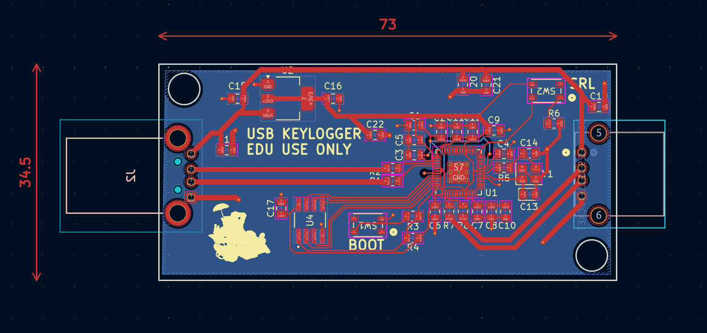

## 2040Listener 

2040Listener is used for USB host/device communication using PIO of raspberry pi pico (RP2040). Build with VSCode Pico Project Extension. 

General idea is core0 acts as the USB communicator to the real host, sending both HID and CDC data over USB. core1 acts as a "fake" host stack to a keyboard (or mouse). Core1 handles getting data from the HID devices, parsing out what the data is and writes to the picos buffers before core0 actually transmits. 

## Versions

|Pico SDK|2.1.1|
|-|-|
|ToolChain|14_2_Rel1|
|PicoTool|2.1.1|
|Cmake|3.31.5|
|Ninja|1.12.1|

## GPIO

|VCC|VBUS|
|-|-|
|D-|GP 1|
|D+|GP 0|
|CNC Toggle|GP 3|
|Ground|GND|

## Credits
Dual host + device listener example from here: https://github.com/brendena/pico_device_and_host, although I used a fork for the Pico VS Code extension: https://github.com/TheLowSpecPC/pico_device_and_host_updated. LittleFS was ported to Pico in this library: https://github.com/tjko/pico-lfs.

