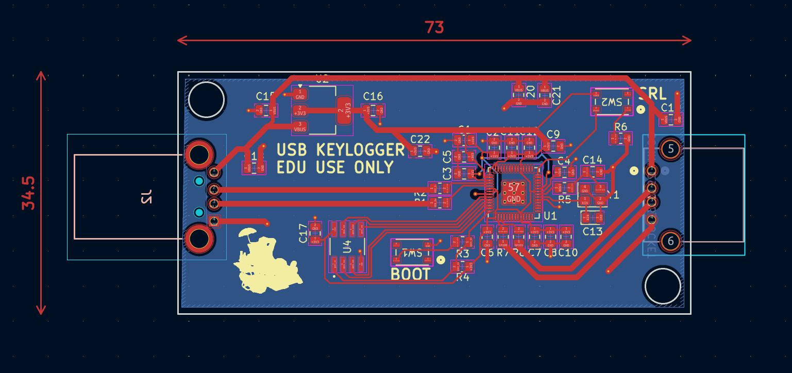

## 2040Listener

This project contains the Raspberry Pi Pico C SDK Project, and Kicad PCB Project, to manufacture an open source MITM style keystroke interceptor. This style of device intercepts a host's computer request to get keystrokes, relays it to a real USB keyboard, and while returning the responses of typed keys, logs it to a LittleFS file stored in flash memory. This memory persists, and can be accessed through a CDC serial port. This port can be toggled on/off for a "stealth" mode.

USB host/device communication is done using the PIO of Raspberry Pi Pico (RP2040). I built the software with the VSCode Pico Project Extension. It uses several other open source libraries, which can be found in the credits section at the bottom of this readme. 

The PCB is designed around the 0805 footprint for easier soldering, and a simple 2 layer board for cheaper manufacturing.

The general idea of the firmware architecture is that core0 of the 2040 acts as a "fake" USB device to the victim computer, sending both HID and CDC data over USB. Core1 acts as a "fake" host stack to a keyboard. Core1 handles getting data from the HID devices, parsing out what the keystroke is and writes to the 2040's LittleFS file before core0 actually transmits. For more details, see my blog post: https://nlessard.online/projects/2040listener/.

**If you decide to build this device yourself, please use it for educational purposes only, and never use it on a computer that you don't control!**

## GPIO 
(This section is useful for testing on a normal Pico board, where access to GP pins is easier.)
|VCC|VBUS|
|-|-|
|D-|GP 1|
|D+|GP 0|
|CNC Toggle|GP 17|
|Ground|GND|

## Credits
Dual host + device listener example from here: https://github.com/brendena/pico_device_and_host, although I used a fork for the Pico VS Code extension: https://github.com/TheLowSpecPC/pico_device_and_host_updated. LittleFS was ported to Pico in this library: https://github.com/tjko/pico-lfs. I used the Raspberry Pi's foundation for a lot of advice during hardware design: https://pip-assets.raspberrypi.com/categories/814-rp2040/documents/RP-008279-DS-1-hardware-design-with-rp2040.pdf
